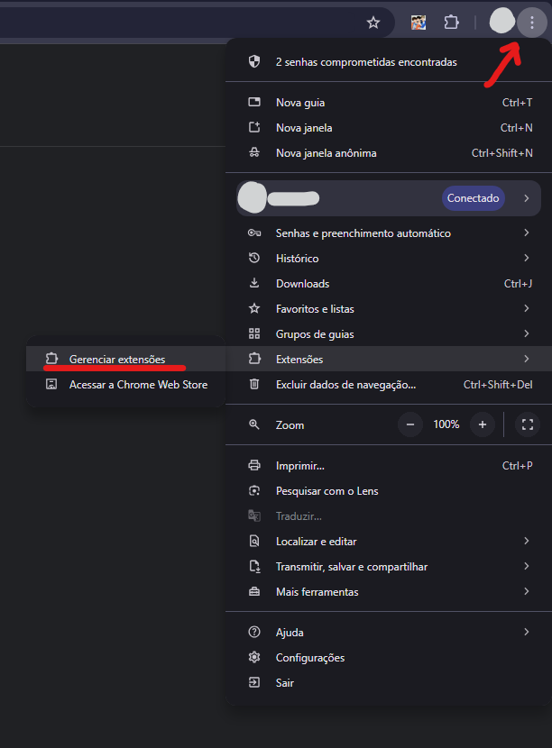
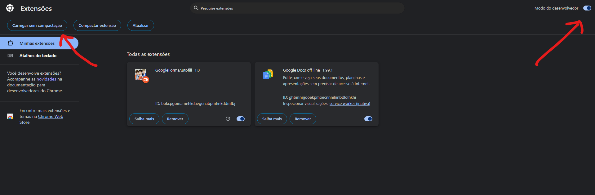
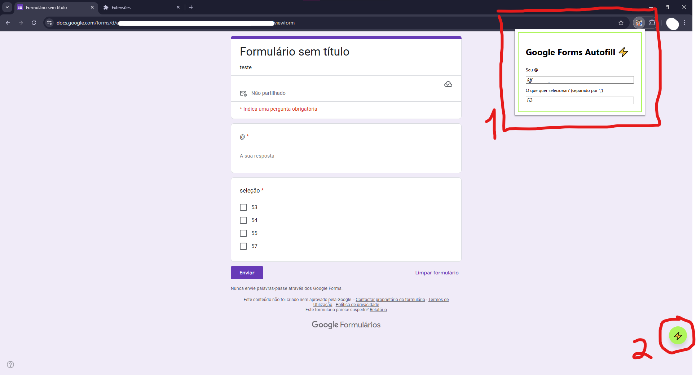

# Google Forms Autofill Extension

> Essa extensão tem o simples propósito de preencher um formulário com um formato bem específico, então dificilmente servirá para seus propósitos, mas atendeu muito bem minhas necessidades *cof cof*

A extensão não está publica, e deverá ser carregada no seu navegador por você mesmo. Cada navegador é diferente, neste tutorial vou ensinar apenas para o Chrome.

#### ⚠️ Atenção! Não me responsabilizo pelo mau uso desta extensão, qualquer problema que possa ocorrer está por sua própria conta e risco.

## Carregando extensões no Google Chrome

1. Acesse a página de "Gerenciar extensões" no seu navegador

2. Para carregar extensões do seu computador, como uma que foi baixada na internet, deve-se primeiro habilitar o "Modo desenvolvedor", geralmente no canto superior direito. Por fim, clique em "Carregar sem compactação" e navegue até a pasta da sua extensão.

E sucesso! Sua extensão agora está habilitada no navegador.

## Utilizando a extensão

Requisitos:
- Tenha a pasta desta extensão na sua máquina. Você pode clonar esse repositório ou baixar a pasta compactada (.zip) pelo GitHub, não se esqueça de descompactar a pasta.
- Habilite a extensão no seu navegador (tutorial acima)

Para começar a utilizar a extensão, é preciso preencher duas informações que serão replicadas no envio do formulário do Google. Esse "autopreenchimento" da extensão funciona apenas para um formulário específico que espera o preenchimento do seu "@" (usuário) e dos itens que deverão ser selecionados (checklist).

1. Para preencher o seu "@" e os itens a serem selecionados, deve-se abrir o painel da extensão pelo navegador. A princípio o ícone dela não aparecerá diretamente na guia, mas pode ser encontrado nas extensões do navegador. Clique no ícone e um pop-up será exibido com os dois campos a serem preenchidos. O campo de itens a serem selecionados (checklist) aceita mais de um item e eles deverão ser separados por vírgula, sem espaços entre eles. Ex: itens "14", "verde" e "churrasqueira" viram "14,verde,churrasqueira", a serem preenchidos sem as aspas, claro. Isso buscará dentre as opções disponíveis de itens no formulário, e selecionará apenas as encontradas para enviar, e o envio ocorrerá caso **pelo menos uma** das opções seja encontrada. O sistema não é tão frágil, mas recomenda-se sempre fechar esse popup (apenas clicando fora dele) assim que terminar de preencher, para garantir a persistência dos dados. 

2. Assim que preenchidas as informações de usuário (@) e itens a serem selecionados, e apenas numa guia onde esteja aberta uma página do Google Forms, deverá aparecer no canto inferior direito um botão verde com um raio, esse botão é o gatilho do nosso autopreenchimento. Quando abrir seu formulário, caso os dados estejam preenchidos corretamente, o botão poderá ser pressionado e ele imediatamente fará o **preenchimento** dos dois campos e também o **envio** do formulário, portanto muita atenção ao pressioná-lo!

E é só! Espero que tenham conseguido utilizar a extensão com sucesso e boas claims pra vocês, meninas 😆
